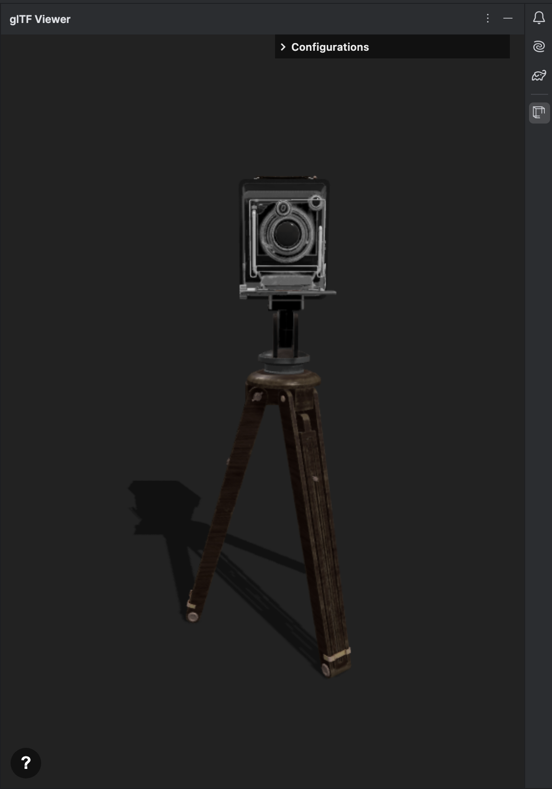
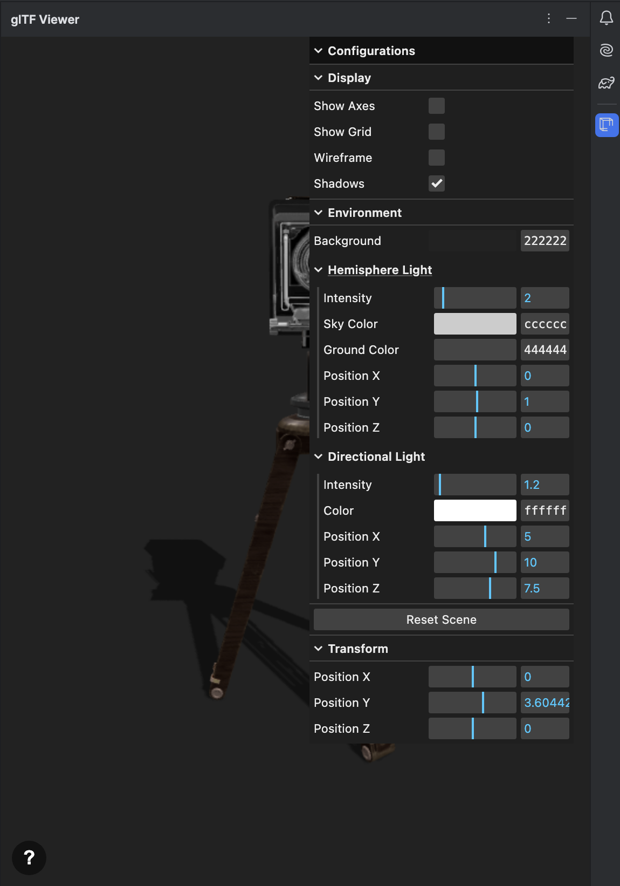

# glTF Viewer for JetBrains IDEs

<!-- Plugin description -->
This plugin allows you to view glTF (`.gltf` and `.glb`) files. It provides an interactive viewer with extensive controls to inspect your 3D models without leaving the IDE. 

https://github.com/tolgacanunal/intellij-gltf-viewer-plugin

<!-- Plugin description end -->

## Features

- **Seamless Integration**: Automatically opens a tool window when you select a `.gltf` or `.glb` file.
- **Interactive 3D Viewer**: A feature-rich viewer powered by `three.js`.
- **Camera Controls**: Intuitive controls for orbiting, panning, and zooming.
- **Scene Customization**:
  - Toggle visibility of grid and axes helpers.
  - Switch to wireframe mode to inspect model geometry.
- **Lighting Control**:
  - Adjust Hemisphere and Directional lights (color, intensity, position).
  - Enable or disable shadows for more realistic rendering.
  - Customize background color.
- **Animation Support**:
  - If your model has animations, you can play, pause, and stop them.
  - Select from multiple animation clips.
  - Control the playback speed.
- **Model Transform**: Adjust the position of the model within the scene.

## Showcase

Here are some screenshots and a video demonstrating the plugin in action.

| 1                                    | 2 |
|:-------------------------------------|--------|
|  ||

_A brief video showing the features._

## Controls and Shortcuts

### Mouse Controls
- **Left-click & drag**: Orbit the camera around the model.
- **Right-click & drag**: Pan the camera.
- **Scroll wheel**: Zoom in and out.

### Keyboard Shortcuts
- **H**: Toggle the configuration panel.
- **R**: Reset the view and all settings to their default state.

## Installation

- Using the IDE built-in plugin system:
  
  <kbd>Settings/Preferences</kbd> > <kbd>Plugins</kbd> > <kbd>Marketplace</kbd> > <kbd>Search for "gLTF Viewer"</kbd> >
  <kbd>Install</kbd>
  
- Using JetBrains Marketplace:

  Go to [JetBrains Marketplace](https://plugins.jetbrains.com/plugin/MARKETPLACE_ID) and install it by clicking the <kbd>Install to ...</kbd> button in case your IDE is running.

  You can also download the [latest release](https://plugins.jetbrains.com/plugin/MARKETPLACE_ID/versions) from JetBrains Marketplace and install it manually using
  <kbd>Settings/Preferences</kbd> > <kbd>Plugins</kbd> > <kbd>⚙️</kbd> > <kbd>Install plugin from disk...</kbd>

- Manually:

  Download the [latest release](https://github.com/tolgacanunal/intellij-gltf-viewer-plugin/releases/latest) and install it manually using
  <kbd>Settings/Preferences</kbd> > <kbd>Plugins</kbd> > <kbd>⚙️</kbd> > <kbd>Install plugin from disk...</kbd>

